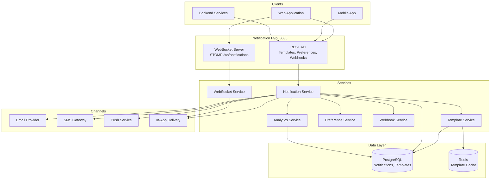

# Notification Hub API

[](https://openjdk.org/)
[](https://spring.io/projects/spring-boot)
[](https://stomp.github.io/)
[](https://redis.io/)
[](https://www.postgresql.org/)
[](Dockerfile)
[](LICENSE)
[](https://github.com/jzavalaq/notification-hub-api/actions/workflows/ci.yml)

> A multi-channel notification platform with real-time WebSocket delivery, template management, user preferences, and webhook integrations.

**Live Demo:** _Coming soon_ | **Swagger UI:** _Coming soon_

---

## Key Features

- **Multi-Channel Delivery**: Email, SMS, Push, and In-App notifications
- **Real-Time WebSocket**: STOMP over WebSocket with SockJS fallback for instant delivery
- **Template Management**: Dynamic templates with variable interpolation and caching
- **User Preferences**: Quiet hours, channel preferences, per-type opt-in/out
- **Webhook Integrations**: Event-driven notifications with retry logic and delivery tracking
- **Analytics Dashboard**: Notification statistics, delivery rates, and engagement metrics
- **Audit Trail**: Complete notification lifecycle tracking for compliance

---

## Architecture



---

## WebSocket Real-Time Notifications

### Connection

```javascript
const socket = new SockJS('http://localhost:8080/ws/notifications');
const stompClient = Stomp.over(socket);

const token = 'your-jwt-token';

stompClient.connect(
  { 'Authorization': 'Bearer ' + token },
  function(frame) {
    console.log('Connected: ' + frame);

    // Subscribe to personal notifications
    stompClient.subscribe('/user/queue/notifications', function(message) {
      const notification = JSON.parse(message.body);
      console.log('Received:', notification);
    });

    // Subscribe to broadcasts
    stompClient.subscribe('/topic/broadcast', function(message) {
      console.log('Broadcast:', JSON.parse(message.body));
    });
  }
);
```

### Send Notification

```javascript
// Send to specific user
stompClient.send('/app/notify.send/john_doe', {}, JSON.stringify({
  type: 'ALERT',
  title: 'New Order',
  message: 'Order #12345 received',
  data: { orderId: '12345' }
}));
```

---

## Architectural Decisions

| Decision | Rationale |
|----------|-----------|
| **STOMP Protocol** | Standard messaging protocol over WebSocket with subscription support |
| **SockJS Fallback** | Graceful degradation for environments blocking WebSocket |
| **Template Caching** | Redis caching for high-throughput template rendering |
| **Preference Layer** | User-controlled notification preferences reduce noise |
| **Webhook Retry** | Exponential backoff for reliable webhook delivery |
| **Audit Logging** | Compliance-ready notification trail |

---

## Tech Stack

| Technology | Version | Purpose |
|------------|---------|---------|
| Java | 21 | Runtime environment |
| Spring Boot | 3.2.5 | Application framework |
| Spring WebSocket | STOMP + SockJS | Real-time messaging |
| Spring Security | 6.x | JWT authentication |
| PostgreSQL | 15+ | Primary database |
| Redis | 7+ | Template caching |
| H2 | 2.x | Development database |
| SpringDoc OpenAPI | 2.5.0 | API documentation |

---

## Quick Start

### Option 1: Docker Compose (Recommended)

```bash
# Clone the repository
git clone https://github.com/jzavalaq/notification-hub-api.git
cd notification-hub-api

# Copy environment file
cp .env.example .env

# Start all services (App + PostgreSQL + Redis)
docker-compose up -d

# View logs
docker-compose logs -f app
```

Services available:
- **API:** http://localhost:8080
- **Swagger UI:** http://localhost:8080/swagger-ui.html
- **WebSocket:** ws://localhost:8080/ws/notifications
- **Health Check:** http://localhost:8080/actuator/health

### Option 2: Local Development (H2)

```bash
# Build and run with H2
mvn spring-boot:run -Dspring-boot.run.profiles=dev

# H2 Console: http://localhost:8080/h2-console
```

---

## API Examples

### Templates

```bash
TOKEN="your-jwt-token"

# Create notification template
curl -X POST http://localhost:8080/api/v1/templates \
  -H "Authorization: Bearer $TOKEN" \
  -H "Content-Type: application/json" \
  -d '{
    "name": "order_confirmation",
    "channel": "EMAIL",
    "subject": "Order #{{orderNumber}} Confirmed",
    "body": "Hi {{userName}}, your order has been confirmed!",
    "variables": ["orderNumber", "userName"]
  }'

# List templates
curl -X GET "http://localhost:8080/api/v1/templates?page=0&size=20" \
  -H "Authorization: Bearer $TOKEN"
```

### Send Notifications

```bash
# Send using template
curl -X POST http://localhost:8080/api/v1/notifications/send \
  -H "Authorization: Bearer $TOKEN" \
  -H "Content-Type: application/json" \
  -d '{
    "templateName": "order_confirmation",
    "recipient": "user@example.com",
    "variables": {
      "orderNumber": "12345",
      "userName": "John"
    },
    "channels": ["EMAIL", "IN_APP"]
  }'

# Get user notifications
curl -X GET "http://localhost:8080/api/v1/notifications/user/user123?page=0&size=20" \
  -H "Authorization: Bearer $TOKEN"
```

### Webhooks

```bash
# Register webhook endpoint
curl -X POST http://localhost:8080/api/v1/webhooks \
  -H "Authorization: Bearer $TOKEN" \
  -H "Content-Type: application/json" \
  -d '{
    "name": "Order Webhook",
    "url": "https://example.com/webhooks/notifications",
    "events": ["notification.delivered", "notification.failed"],
    "secret": "webhook-secret-key"
  }'
```

### User Preferences

```bash
# Set notification preferences
curl -X PUT http://localhost:8080/api/v1/preferences/user123 \
  -H "Authorization: Bearer $TOKEN" \
  -H "Content-Type: application/json" \
  -d '{
    "emailEnabled": true,
    "smsEnabled": false,
    "pushEnabled": true,
    "quietHoursStart": "22:00",
    "quietHoursEnd": "08:00"
  }'
```

---

## Notification Types

| Type | Priority | Use Case |
|------|----------|----------|
| `ALERT` | High | Security alerts, new orders |
| `INFO` | Normal | System updates, tips |
| `SUCCESS` | Normal | Payment received, task completed |
| `WARNING` | Medium | Low balance, expiring soon |
| `SYSTEM` | High | Maintenance, downtime |
| `CHAT` | Normal | Messages, typing indicators |

---

## Configuration

### Environment Variables

| Variable | Description | Default |
|----------|-------------|---------|
| `DB_URL` | PostgreSQL connection URL | `jdbc:postgresql://localhost:5432/notificationhub` |
| `DB_USERNAME` | Database username | `notification_user` |
| `DB_PASSWORD` | Database password | _Required_ |
| `REDIS_URL` | Redis connection URL | `redis://localhost:6379` |
| `JWT_SECRET` | JWT signing key (256+ bits) | _Required_ |

---

## Project Structure

```
src/main/java/com/jzavalaq/notificationhub/
├── config/          # WebSocket, Security, Redis configuration
├── controller/      # REST API endpoints
├── service/         # Business logic (Notification, Template, Webhook)
├── repository/      # Data access layer
├── entity/          # JPA entities
├── dto/             # Request/Response DTOs
├── security/        # JWT authentication
└── exception/       # Custom exceptions
```

---

## Testing

```bash
# Run all tests
mvn test

# Run with coverage
mvn test jacoco:report
```

---

## License

This project is licensed under the MIT License - see the [LICENSE](LICENSE) file for details.

---

## Author

**Juan Zavala** - [GitHub](https://github.com/jzavalaq) - [LinkedIn](https://linkedin.com/in/juanzavalaq)
